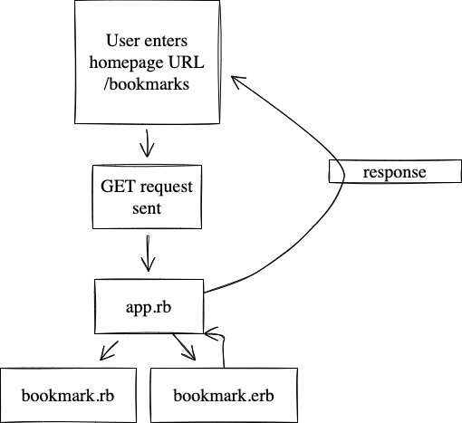

# bookmark_manager
This week, we will build a web app that stores web bookmarks in a database. A bookmark manager is a website to maintain a collection of bookmarks (URLs). You can use it to save a webpage you found useful. You can add tags to the webpages you saved to find them later. You can browse bookmarks other users have added. You can comment on the bookmarks.

Learning objectives:

You will work towards these new goals:
Diagram the data flow from user action to server resource and back again
Explain the basics of how databases work, including:
What tables are and how they are structured
What structured query language (SQL) is used for
One to one relationships
One to many relationships
Many to many relationships
Follow an effective debugging process for database-backed web applications
Build a simple web app that can read from and write to a database.

First user story for 'Show a list of bookmarks':

As a very busy user
So I can manage my most visited websites
I would like to view a list of bookmarks

<br>



<br>

As a very busy user
So that I can save a website
I would like to add the site's address and title to bookmark manager

Clone this repository and then run:
bundle

### To set up the database

Connect to `psql` and create the `bookmarkmanager` and `bookmark_manager_test` databases:

```
CREATE DATABASE bookmarkmanager;
CREATE DATABASE bookmark_manager_test;
```

To set up the appropriate tables, connect to each database in `psql` and run the SQL scripts in the `db/migrations` folder in the given order.

### To run the Bookmark Manager app:

```
rackup -p 3000
```
To view bookmarks, navigate to `localhost:3000/bookmarks`.

### To run tests:

```
rspec
```
### To run linting:
```
rubocop
```

## Core challenges
- [x] Creating User Stories
- [x] Setting up a Web Project
- [x] Viewing bookmarks
- [x] Setting up a Database
- [x] Creating your First Table
- [x] Manipulating Table Data
- [x] Interacting with Postgres from Ruby
- [x] Upgrading your Toolset
- [x] Setting up a Testing Environment
- [ ] Creating bookmarks
- [ ] Wrapping Database data in program objects
- [ ] Securing Your App
- [ ] Deleting bookmarks